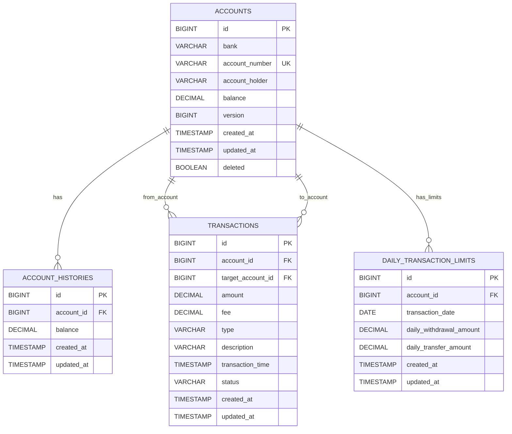

# Wirebarley Service
송금서비스 코딩테스트 과제입니다.

## 데이터베이스 ERD (Entity Relationship Diagram)



### 테이블 설명
- **ACCOUNTS**: 계좌 기본 정보 (Soft Delete 지원)
- **ACCOUNT_HISTORIES**: 계좌 잔액 변경 이력
- **TRANSACTIONS**: 모든 거래 내역 (입금/출금/이체)
- **DAILY_TRANSACTION_LIMITS**: 일일 거래 한도 관리

### 주요 비즈니스 규칙
- 일일 출금 한도: **1,000,000원**
- 일일 이체 한도: **3,000,000원**
- 이체 수수료: **1%**
- 지원 은행: **KB, SHINHAN, NH, WOORI, KAKAO**

## Docker Compose 실행 방법
### 요구사항
- Docker Desktop 또는 Docker Engine
- Docker Compose v3.8+

#### 서버 실행
```bash
# 실행
docker-compose up

# 중지
docker-compose down
```
**특징:**
- H2 인메모리 데이터베이스
- 간단한 설정
- 빠른 시작

**접속 정보:**
- 애플리케이션: http://localhost:8080
- H2 콘솔: http://localhost:8080/h2-console

**접속 정보:**
- 애플리케이션: http://localhost:8080
- PostgreSQL: localhost:5432

### 공통 명령어
```bash
# 로그 확인
docker-compose logs -f

# 상태 확인
docker-compose ps

# 완전 삭제 (볼륨 포함)
docker-compose down -v --remove-orphans

# 헬스 체크
curl http://localhost:8080/actuator/health
```

### H2 데이터베이스 콘솔 접속

**개발 환경 (Basic)**
1. http://localhost:8080/h2-console 접속
2. 로그인:
   - **JDBC URL**: `jdbc:h2:mem:wirebarley`
   - **User Name**: `sa`
   - **Password**: (공백)

### Swagger 접속
1. http://localhost:8080/swagger-ui/index.html 접속

## 프로젝트 구조

```
wirebarley/
├── account/         # 계좌 관리 모듈
├── transaction/     # 거래 관리 모듈
├── common/          # 공통 설정 및 엔티티
└── src/            # 통합 애플리케이션
```

## 실행 방법

### 통합 서버 실행 (권장)
```bash
# 프로젝트 루트에서
./gradlew bootRun
```
또는
```bash
./gradlew build
java -jar build/libs/wirebarley-0.0.1-SNAPSHOT.jar
```

### 개별 모듈 실행
```bash
# Account 서비스
./gradlew :account:bootRun

# Transaction 서비스
./gradlew :transaction:bootRun
```

## API 엔드포인트
### 통합 서버 (localhost:8080)

#### 헬스체크
- `GET /` - 서비스 정보
- `GET /health` - 헬스체크

#### 계좌 관리
- `POST /account` - 계좌 생성
- `DELETE /account/{accountId}` - 계좌 삭제

#### 거래 관리
- `POST /transactions/deposit` - 입금
- `POST /transactions/withdrawal` - 출금
- `POST /transactions/transfer` - 이체
- `GET /transactions/limits/{accountId}` - 일일 한도 조회

## 데이터베이스

- H2 인메모리 데이터베이스 사용
- H2 콘솔: http://localhost:8080/h2-console
  - JDBC URL: `jdbc:h2:mem:wirebarley`
  - Username: `sa`
  - Password: (공백)

## 설정

### 거래 한도 및 수수료
```yaml
transaction:
  limit:
    daily:
      withdrawal: 1000000  # 일일 출금 한도 (100만원)
      transfer: 3000000    # 일일 이체 한도 (300만원)
  fee:
    transfer: 0.01         # 이체 수수료 (1%)
```

## 테스트

### 전체 테스트
```bash
./gradlew test
```

### 개별 모듈 테스트
```bash
./gradlew :account:test
./gradlew :transaction:test
```

## 빌드

```bash
./gradlew build
```

생성된 JAR 파일: `build/libs/wirebarley-0.0.1-SNAPSHOT.jar`

## 비즈니스 규칙

### 거래 한도
- 일일 출금 한도: 1,000,000원
- 일일 이체 한도: 3,000,000원

### 수수료
- 이체 수수료: 이체 금액의 1%

### 지원 은행
- KB (국민은행)
- SHINHAN (신한은행) 
- NH (농협은행)
- WOORI (우리은행)
- KAKAO (카카오뱅크)

## 주요 기능

- 계좌 생성 및 삭제
- 입금, 출금, 이체 처리
- 일일 거래 한도 관리
- 이체 수수료 계산
- 거래 내역 관리
- Swagger API 문서화
- 멀티모듈 아키텍처
- 통합 테스트 및 커버리지

## 사용 예시

### 1. 계좌 생성
```bash
curl -X POST http://localhost:8080/account \
  -H "Content-Type: application/json" \
  -d '{
    "bank": "KB",
    "accountNumber": "123-456-789012",
    "accountHolder": "홍길동"
  }'
```

### 2. 입금
```bash
curl -X POST http://localhost:8080/transactions/deposit \
  -H "Content-Type: application/json" \
  -d '{
    "accountId": 1,
    "amount": 10000
  }'
```

### 3. 이체
```bash
curl -X POST http://localhost:8080/transactions/transfer \
  -H "Content-Type: application/json" \
  -d '{
    "accountId": 1,
    "targetAccountId": 2,
    "amount": 5000,
    "senderMemo": "친구에게 이체",
    "receiverMemo": "용돈"
  }'
```

### 4. 거래 내역 조회
```bash
curl -X GET http://localhost:8080/transactions/history/1
```

응답 예시:
```json
[
  {
    "transactionId": 3,
    "type": "TRANSFER",
    "amount": 5000,
    "fee": 50,
    "description": "친구에게 이체",
    "counterpartyAccountId": 2,
    "status": "COMPLETED",
    "transactionTime": "2024-12-27T10:30:00",
    "balanceChange": -5050
  },
  {
    "transactionId": 2,
    "type": "WITHDRAWAL",
    "amount": 3000,
    "fee": 0,
    "description": "출금",
    "counterpartyAccountId": null,
    "status": "COMPLETED",
    "transactionTime": "2024-12-27T10:25:00",
    "balanceChange": -3000
  },
  {
    "transactionId": 1,
    "type": "DEPOSIT",
    "amount": 10000,
    "fee": 0,
    "description": "입금",
    "counterpartyAccountId": null,
    "status": "COMPLETED",
    "transactionTime": "2024-12-27T10:20:00",
    "balanceChange": 10000
  }
]
```